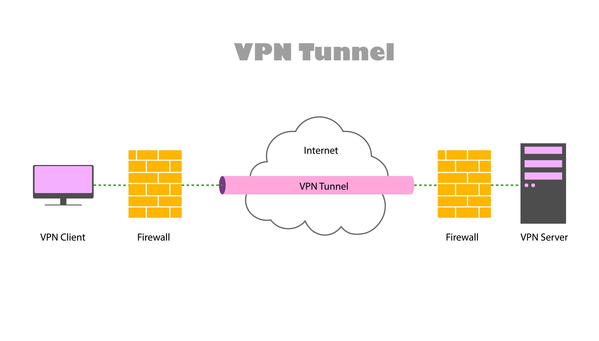
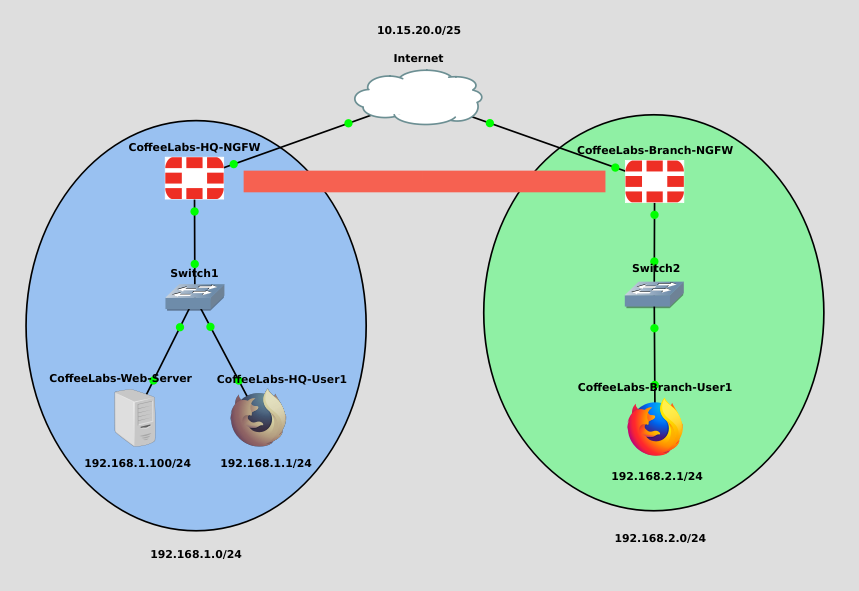

# Secure Inter-Branch Connectivity via IPsec Site-to-Site VPN with Fortigate NGFW

## Project Goal
- Establish a secure, encrypted, and persistent Site-to-Site VPN tunnel between two geographically separate networks (HQ and Branch) using Next-Generation Firewalls (NGFWs) over a simulated public Internet connection.  
- This project demonstrates practical implementation of IPsec VPN, routing, and security policies in a virtualized lab environment.

### This project will contain three parts:
- [Part 1: Initial Devices' Configuration](./Part%201:%20Initial%20Devices'%20Configuration.md)
- [Part 2: IPsec VPN Tunnel Configuration](./Part%202:%20IPsec%20VPN%20Tunnel%20Configuration.md)
- [Part 3: Enabling Tunnel Traffic (Policies & Routing)](./Part%203:%20Enabling%20Tunnel%20Traffic%20(Policies%20&%20Routing).md)
---

## Key Technologies & Skills Demonstrated

| Technology | Skill Demonstrated |
|------------|------------------|
| **IPsec (Internet Protocol Security)** | Configured IKE Phase 1 and ESP/Tunnel Mode Phase 2, demonstrating understanding of secure key exchange and encryption. |
| **Network Address Translation (NAT)** | Implemented NAT exemption (no-NAT) for VPN traffic to ensure proper routing between sites. |
| **Firewall & Security Policies** | Created explicit security policies to control traffic flow between encrypted zones. |
| **Routing** | Defined static routes and leveraged dynamic routing protocols to direct traffic to the VPN tunnel interface. |

---

## Project Topology Overview

**Site 1: CoffeeLabs-HQ**  
- WAN: `10.15.20.0/25`
- Internal Network: `192.168.1.0/24`  
- Gateway: `CoffeeLabs-HQ-NGFW`  

**Site 2: CoffeeLabs-Branch**  
- WAN: `10.15.20.0/25`
- Internal Network: `192.168.2.0/24`  
- Gateway: `CoffeeLabs-Branch-NGFW`  

**Objective:** Enable secure communication between the two sites such that devices on the HQ LAN can access services on the Branch LAN.

---

## Deliverables & Outcomes

1. **Functional Secure Tunnel**  
   - Verified that a client on HQ LAN (e.g., `CoffeeLabs-Branch-User1`) can successfully ping and access the Web Server on Branch LAN (`CoffeeLabs-Web-Server`).  

2. **Configuration Documentation**  
   - Detailed configuration of:  
     - Cryptographic parameters (AES-256, SHA-256, Diffie-Hellman Group 14)  
     - IP addressing schemes  
     - Firewall rules and policies  

3. **Troubleshooting Log**  
   - Documented common VPN negotiation errors and resolutions:  
     - Mismatched pre-shared keys  
     - Misconfigured Static Routing/Firewall Policy  

---

## Key Achievements
- Successfully built and tested a secure Site-to-Site IPsec VPN tunnel.  
- Demonstrated advanced configuration skills with Fortigate NGFW, including routing, and firewall policy enforcement.  
- Developed troubleshooting documentation for VPN connectivity issues.
